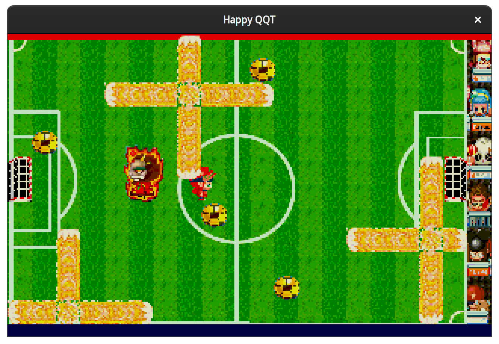

# HappyQQT-ASM
An Intel 8086 Emulator for QQTang-ASM.




## Control 
- Move the player
    WASD
- Enter game
    space

## Requirement
- G++ with pthread
- OpenGL
    - OpenGL
    - GLUT
    - GLU

## Build
```bash
make
```

## Run
```bash
./main
```
